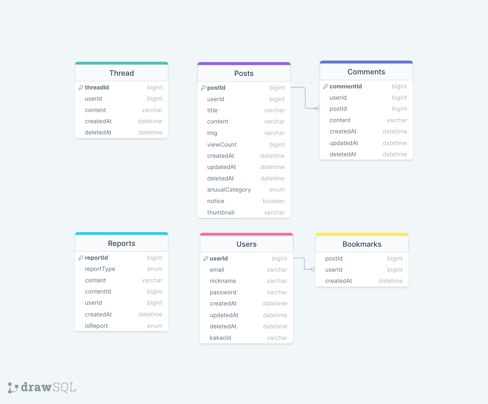
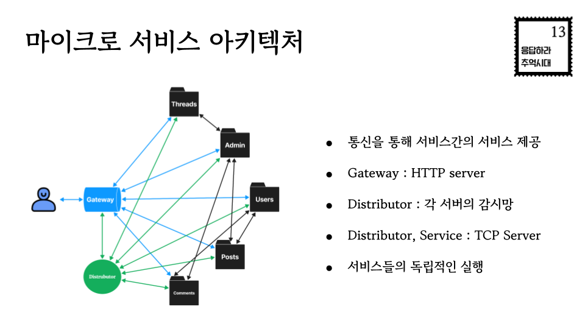
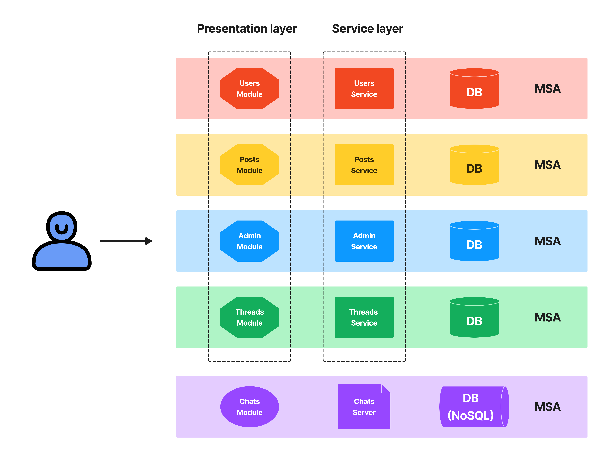

# 응답하라 추억시대

누군가의 기억을 가치있게 생각하는 공간, “ 응답하라 추억시대 “ 입니다.

- 배포 주소 : http://resmemory.shop

# 🎞️ TEAM

- 팀 명
  1이 3김
- 팀원 소개
  | 역할 | 이름 | Blog |
  | ------------------- | ------ | -------------------------------- |
  | 리더 | 이다영 | https://verdantjuly.tistory.com/ |
  | 부리더, 회의록, Git | 김주희 | https://velog.io/@kinjoo |
  | CS 스터디 관리 | 김민규 | https://minker.tistory.com/ |
  | 기술 면접 관리 | 김지혜 | https://velog.io/@gajigaji04 |
- 기능 역할 분담
  | 이름 | Backend | Frontend |
  | ------ | -------------------------- | -------------------------------- |
  | 이다영 | 회원, 북마크, CI/CD | 로그인 페이지, 프로필 페이지 |
  | 김주희 | 추억 게시판 CRUD 댓글 CRUD | 메인페이지, 연도별 게시판, 글 작성 페이지|
  | 김민규 | 관리자 D 신고 CR | 관리자 페이지, 글 상세페이지 |
  | 김지혜 | 익명 스레드 CRD | 스레드 페이지 |
  - 테스트 코드 : 각자 작성한 API integration test
- 기타 역할 분담
  | 이름 | 기타 역할 |
  | ------ | --------------------------------------- |
  | 이다영 | 중간 발표, S.A. , 회의 진행 |
  | 김주희 | 최종 시연 영상, 회의록 작성, Git 책임자 |
  | 김민규 | 최종 발표, CS 스터디 관리 |
  | 김지혜 | 기술면접 30제 관리 |
- 팀 규칙 및 정규 일정
  - 회의 : 평일 아침 9시 15분(to-do, Q&A), 오후 9시 15분 (merge, code review, TIL)
  - CS study : 수 오후 2시~
  - 기술면접 : 목 오후 2시 ~ 3시
  - 기술 멘토링 : 매주 금요일 오전 11시~ 11시 30분 - 조호영 튜터 님
  - Ground Rules
    ```jsx
    1. 마지막까지 `FULL POWER`로!!
    2. 120분 이상 현자가 되면 이슈 공유, 모두가 함께 현자 되어서 해결하기
    3. 나쁜 말 쓰면 `예쁜 말`로 공격하기
    4. 30분까지의 화장실 및 리프레시 이슈는 `nearby`, 30분 이상 미안해요는 `슬랙`에 남기기
    5. 하루 동안 못 보면 DM 폭탄, 리벤지가 없는 경우 중대장이 담임매니저님께 `미사일` 날리기
    ```
- 개발 일정

  개발 기간 : 2023년 8월 16일 ~ 2023년 9월 15일

  [최종 프로젝트 개발 일정](https://www.notion.so/d1ecaba5df66497ba1cec65b342b814c?pvs=21)

  [3조 CS 팀노션 ](https://www.notion.so/3-CS-afe422624b0b42a0a5e7ecee542333d7?pvs=21)

  [최종 프로젝트 회의록](https://www.notion.so/292995ec82cf49a1927783fcb4f10747?pvs=21)

  [타임라인](https://docs.google.com/spreadsheets/d/1VS6DMNqZnL9hOqyVi8oYATI6MF64jqYQTbuQ6T2LZA0/edit?usp=sharing)

# 📽️ Project

- 프로젝트 명
  응답하라 추억시대
- 프로젝트 목적과 기능
  추억 공유 게시판 커뮤니티
  게시글과 댓글을 통해 서로의 추억을 교환하며 추억을 쌓아나간다.

# ✒️ Coding Convention

- 변수, 클래스, 함수 네이밍
  - 변수 : 카멜케이스, const, let (var X), 명명 시 진지하게 고민
  - 클래스 : 클래스명 첫 글자는 대문자
- prettierrc : airbnb
  ```jsx
  module.exports = {
    printWidth: 80, // 한 줄 최대 문자 수
    tabWidth: 2, // 들여쓰기 시, 탭 너비
    useTabs: false, // 스페이스 대신 탭 사용
    semi: true, // 문장 끝 세미콜론 사용
    singleQuote: true, // 작은 따옴표 사용
    trailingComma: 'all', // 꼬리 콤마 사용
    bracketSpacing: true, // 중괄호 내에 공백 사용
    arrowParens: 'avoid', // 화살표 함수 단일 인자 시, 괄호 생략
    proseWrap: 'never', // 마크다운 포매팅 제외
    endOfLine: 'auto', // 개행문자 유지 (혼합일 경우, 첫 줄 개행문자로 통일)
  };
  ```
- GitHub

  - Organization 이용하여 Repository 생성  
    **[ Commit Message ]**  
    `feat` : 새로운 기능 추가 (Add …)  
    `fix` : 코드 수정 (Change, Delete …)  
    `docs` : 문서 수정 (README.md 등)  
    `style` : 코드에 변경이 없는 단순 줄바꿈, 여백 수정  
    `refactor` : 코드 리팩토링  
    `test` : 테스트 코드 추가  
    `chore` : 빌드 업무 수정, 패키지 매니저 수정  
    **[기능별 브랜치]**  
    `users` : 회원  
    `thread` : 댓글 스레드  
    `posts` : 게시판  
    `admin` : 관리자  
    **[최종 집합 브랜치]**  
    `develope` : 기능별 브랜치 집합  
    `release` : 배포 전 테스트  
    `master` : 배포  
    **[기타 브랜치]**  
    `hotfix` : 긴급 수정  
    `readme`  
    `frontend`
  - Commit Message 내용은 한글로 작성
  - Commit 전에 불필요한 주석 삭제

- API 명세서 준수, 변경사항 있는 경우 모두에게 승인 받고 진행
- GET : query, params 만 사용

# 📋 API

[응답하라 추억시대 API 명세서](https://www.notion.so/c01e87e20d754c11a0d8d93740057ab2?pvs=21)

[admin 서비스 코드 별 메시지](https://www.notion.so/b70891e997b645b380b20bb319b4a965?pvs=21)

[threads 서비스 코드 별 메시지](https://www.notion.so/579d2688a1cc48e89d6c0b27a23d7af5?pvs=21)

[posts 서비스 코드 별 메시지](https://www.notion.so/0902402573a04ca9ab7ee5d1cadceed3?pvs=21)

[users 서비스 코드 별 메시지 ](https://www.notion.so/48d24a5b914343dbab06c239c62cbcec?pvs=21)

# 📔 ERD

[https://drawsql.app/teams/verdantjuly/diagrams/resmemory](https://drawsql.app/teams/verdantjuly/diagrams/resmemory)



# 📽️ Project Architecture




# 💻 Tech Spec

- Backend Language : Node.js (ver 18.17.0)
- Frontend Language : Html5, Javascript
- Server : Amazon EC2
- Project Management : PM2
- DB : mysql(ver.3.6.0)
- Cache : Redis(ver.4.6.7)
- CI/CD : Github Actions, Code Deploy

# 📁 Directory Structure

```
resmemory
├─ .prettierrc
├─ README.md
├─ appspec.yml
├─ babel.config.json
├─ package-lock.json
├─ package.json
├─ scripts
│  └─ after-deploy.sh
├─ sql
│  └─ database.sql
└─ src
   ├─ app.js
   ├─ authmiddleware.js
   ├─ classes
   │  ├─ client.js
   │  └─ server.js
   ├─ frontconnection.js
   ├─ mail.js
   ├─ modules
   │  ├─ admin
   │  │  ├─ admin.module.js
   │  │  ├─ admin.service.js
   │  │  ├─ db
   │  │  │  ├─ reports.db.js
   │  │  │  └─ reports.init.js
   │  │  └─ report.service.js
   │  ├─ distributor.js
   │  ├─ posts
   │  │  ├─ db
   │  │  │  ├─ comments.db.js
   │  │  │  ├─ posts.db.js
   │  │  │  ├─ posts.init.js
   │  │  │  └─ relationship.js
   │  │  ├─ posts.module.js
   │  │  └─ posts.service.js
   │  ├─ threads
   │  │  ├─ db
   │  │  │  ├─ threads.db.js
   │  │  │  └─ threads.init.js
   │  │  ├─ threads.module.js
   │  │  └─ threads.service.js
   │  └─ users
   │     ├─ db
   │     │  ├─ bookmarks.db.js
   │     │  ├─ relationship.js
   │     │  ├─ users.db.js
   │     │  └─ users.init.js
   │     ├─ signup.service.js
   │     ├─ users.module.js
   │     └─ users.service.js
   ├─ public
   │  ├─ admin.html
   │  ├─ annual.html
   │  ├─ assets
   │  │  └─ image
   │  │     ├─ architecture1.png
   │  │     ├─ architecture2.png
   │  │     ├─ architecture3.png
   │  │     ├─ erd.png
   │  │     ├─ logo.png
   │  │     └─ thumbnail.png
   │  ├─ css
   │  │  ├─ admin.css
   │  │  ├─ detail.css
   │  │  ├─ headerButtons.css
   │  │  ├─ login.css
   │  │  ├─ post.css
   │  │  ├─ postlist.css
   │  │  ├─ profile.css
   │  │  ├─ reset.css
   │  │  └─ threads.css
   │  ├─ detail.html
   │  ├─ index.html
   │  ├─ js
   │  │  ├─ admin.js
   │  │  ├─ annual.js
   │  │  ├─ code.js
   │  │  ├─ detail.js
   │  │  ├─ index.js
   │  │  ├─ login.js
   │  │  ├─ post.js
   │  │  ├─ profile.js
   │  │  └─ threads.js
   │  ├─ login.html
   │  ├─ notfound.html
   │  ├─ post.html
   │  ├─ profile.html
   │  └─ threads.html
   ├─ redis.js
   └─ utils
      └─ makePacket.js

```
