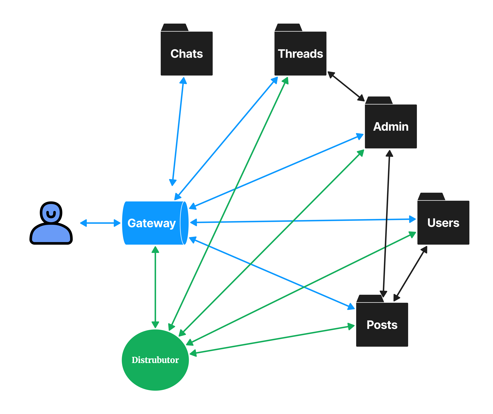

# G:Then

그땐 그랬지, “ G:Then “ 입니다.

- 배포 주소 : http://resmemory.store
- 브로셔 : https://gleaming-harp-2af.notion.site/f6539553476e4602bce58d1cd8bceeda

# 🎞️ TEAM

- 팀 명
  resmemory
- 팀원 소개
  | 역할 | 이름 | Blog |
  | ------------------- | ------ | -------------------------------- |
  | 리더, BE, FE | 이다영 | https://verdantjuly.tistory.com/ |
  | 부리더, BE | 김주희 | https://velog.io/@kinjoo |
  | BE | 김민규 | https://minker.tistory.com/ |
  | BE | 김지혜 | https://velog.io/@gajigaji04 |
  | UI/UX | 송정현 | |
  | FE | 장시훈 | |
  | FE | 배찬용 | |
  | FE | 이은찬 | |
- 개발 팀 기능 역할 분담
  | 이름 | Backend | Frontend |
  | -------- | -------------------------- | ---------------------------- |
  | 이다영 | Users 서비스, CI/CD, 테스트코드, 로그전략 | 채팅, 글 작성 페이지, 스레드 페이지, 카카오 로그인 |
  | 김주희 | Posts 서비스, 로그전략 | |
  | 김민규 | Admin 서비스, Chat 서비스 | |
  | 김지혜 | Threads 서비스, 테스트코드 | 로그인 페이지 |
  | 장시훈 | | 마이페이지, 일반 로그인 |
  | 배찬용 | | 메인페이지 |
  | 이은찬 | | 관리자페이지 |

- 개발 일정
  | 분류 | 기간 |
  | ------------- | -------------------------- |
  | 1차 개발 기간 | 2023년 8월 16일 ~ 2023년 9월 15일 |
  | 2차 개발 기간 | 2023년 9월 16일 ~ 2024년 2월 |

- 개발 과정

  [타임라인](https://docs.google.com/spreadsheets/d/1VS6DMNqZnL9hOqyVi8oYATI6MF64jqYQTbuQ6T2LZA0/edit?usp=sharing)

  [프로젝트 회의록](https://www.notion.so/292995ec82cf49a1927783fcb4f10747?pvs=21)

# 📽️ Project

- 프로젝트 명
  그땐(G:Then)
- 프로젝트 목적과 기능
  추억 공유 게시판 커뮤니티
  게시글과 댓글을 통해 서로의 추억을 교환하며 채팅과 익명을 통해 새로운 추억을 쌓아나간다.

# ✒️ Coding Convention

- 변수, 클래스, 함수 네이밍
  - 변수 : 카멜케이스, const, let (var X), 명명 시 진지하게 고민
  - 클래스 : 클래스명 첫 글자는 대문자
- prettierrc : airbnb
  ```jsx
  module.exports = {
    printWidth: 80, // 한 줄 최대 문자 수
    tabWidth: 2, // 들여쓰기 시, 탭 너비
    useTabs: false, // 스페이스 대신 탭 사용
    semi: true, // 문장 끝 세미콜론 사용
    singleQuote: true, // 작은 따옴표 사용
    trailingComma: 'all', // 꼬리 콤마 사용
    bracketSpacing: true, // 중괄호 내에 공백 사용
    arrowParens: 'avoid', // 화살표 함수 단일 인자 시, 괄호 생략
    proseWrap: 'never', // 마크다운 포매팅 제외
    endOfLine: 'auto', // 개행문자 유지 (혼합일 경우, 첫 줄 개행문자로 통일)
  };
  ```
- GitHub

  - Organization 이용하여 Repository 생성  
    **[ Commit Message ]**  
    `feat` : 새로운 기능 추가 (Add …)  
    `fix` : 코드 수정 (Change, Delete …)  
    `docs` : 문서 수정 (README.md 등)  
    `style` : 코드에 변경이 없는 단순 줄바꿈, 여백 수정  
    `refactor` : 코드 리팩토링  
    `test` : 테스트 코드 추가  
    `chore` : 빌드 업무 수정, 패키지 매니저 수정  
    **[기능별 브랜치]**  
    `users` : 회원  
    `thread` : 댓글 스레드  
    `posts` : 게시판  
    `admin` : 관리자  
    **[최종 집합 브랜치]**  
    `develope` : 기능별 브랜치 집합  
    `release` : 배포 전 테스트  
    `master` : 배포  
     **[프론트 엔드 브랜치]**  
    `frontend` : 프론트엔드 집합 브랜치  
    `frontend_(각자 이니셜)` : 개인 프론트엔드 브랜치  
     **[기타 브랜치]**  
    `hotfix` : 긴급 수정  
    `readme`

  - Commit 전에 불필요한 주석 삭제

- API 명세서 준수, 변경사항 있는 경우 모두에게 승인 받고 진행
- GET : query, params 만 사용

# 📋 API

[응답하라 추억시대 API 명세서](https://www.notion.so/c01e87e20d754c11a0d8d93740057ab2?pvs=21)

[admin 서비스 코드 별 메시지](https://www.notion.so/b70891e997b645b380b20bb319b4a965?pvs=21)

[threads 서비스 코드 별 메시지](https://www.notion.so/579d2688a1cc48e89d6c0b27a23d7af5?pvs=21)

[posts 서비스 코드 별 메시지](https://www.notion.so/0902402573a04ca9ab7ee5d1cadceed3?pvs=21)

[users 서비스 코드 별 메시지 ](https://www.notion.so/48d24a5b914343dbab06c239c62cbcec?pvs=21)

# 📔 ERD

[https://drawsql.app/teams/verdantjuly/diagrams/resmemory](https://drawsql.app/teams/verdantjuly/diagrams/resmemory)


# 📽️ Project Architecture




# 💻 Tech Spec

- Backend Language : Node.js (ver 18.19.0)
- Frontend Language : Html5, Javascript
- Server : Amazon EC2
- DB : mysql(ver.8.0.35), MongoDB
- Cache : Redis(ver.6.2.6)
- CI/CD : Github Actions, Code Deploy
- WebSocket, Nodemailer, S3

# 📁 Directory Structure

```
resmemory
├─ .github
│  └─ workflows
│     ├─ build.yml
│     ├─ deploy.yml
│     └─ test.yml
├─ .gitignore
├─ .prettierrc
├─ README.md
├─ __tests__
│  └─ integeration
│     ├─ mock.posts.module.js
│     ├─ mock.threads.module.js
│     ├─ mock.users.module.js
│     ├─ posts.integration.spec.js
│     ├─ threads.integration.spec.js
│     └─ users.integration.spec.js
├─ appspec.yml
├─ nodemon.json
├─ package-lock.json
├─ package.json
├─ scripts
│  └─ after-deploy.sh
├─ sql
│  ├─ database.sql
│  └─ dummydata.sql
└─ src
   ├─ app.js
   ├─ authmiddleware.js
   ├─ classes
   │  ├─ client.js
   │  └─ server.js
   ├─ frontconnection.js
   ├─ logger.js
   ├─ loginResponse.js
   ├─ mail.js
   ├─ modules
   │  ├─ admin
   │  │  ├─ admin.module.js
   │  │  ├─ admin.service.js
   │  │  ├─ db
   │  │  │  ├─ reports.db.js
   │  │  │  └─ reports.init.js
   │  │  └─ report.service.js
   │  ├─ chat
   │  │  ├─ chat.module.js
   │  │  ├─ chat.server.js
   │  │  └─ db
   │  │     ├─ counter.collection.js
   │  │     └─ mongoose.js
   │  ├─ distributor.js
   │  ├─ posts
   │  │  ├─ db
   │  │  │  ├─ comments.db.js
   │  │  │  ├─ posts.db.js
   │  │  │  ├─ posts.init.js
   │  │  │  └─ relationship.js
   │  │  ├─ imageManager.js
   │  │  ├─ posts.module.js
   │  │  └─ posts.service.js
   │  ├─ threads
   │  │  ├─ db
   │  │  │  ├─ threads.db.js
   │  │  │  └─ threads.init.js
   │  │  ├─ threads.module.js
   │  │  └─ threads.service.js
   │  └─ users
   │     ├─ db
   │     │  ├─ bookmarks.db.js
   │     │  ├─ relationship.js
   │     │  ├─ users.db.js
   │     │  └─ users.init.js
   │     ├─ signup.service.js
   │     ├─ users.module.js
   │     └─ users.service.js
   ├─ public
   │  ├─ assets
   │  │  └─ image
   │  │     ├─ Untitled.png
   │  │     ├─ architecture1.png
   │  │     ├─ architecture2.png
   │  │     ├─ erd.png
   │  │     ├─ kakao_login_large_narrow.png
   │  │     ├─ thn_logo.png
   │  │     └─ thumbnail.png
   │  ├─ index.html
   │  ├─ js
   │  │  └─ code.js
   │  ├─ jsx
   │  │  ├─ components
   │  │  │  ├─ admin
   │  │  │  │  ├─ DeleteButton.jsx
   │  │  │  │  ├─ FilterReport.jsx
   │  │  │  │  ├─ GetReport.jsx
   │  │  │  │  ├─ ReportContainer.jsx
   │  │  │  │  └─ ShowContent.jsx
   │  │  │  ├─ login
   │  │  │  │  ├─ General_Login.jsx
   │  │  │  │  ├─ Kakao_Login.jsx
   │  │  │  │  ├─ LoginMain.jsx
   │  │  │  │  ├─ LoginPage.css
   │  │  │  │  └─ button
   │  │  │  │     └─ loginButton.jsx
   │  │  │  ├─ main
   │  │  │  │  ├─ annual.css
   │  │  │  │  ├─ board.css
   │  │  │  │  ├─ board.jsx
   │  │  │  │  ├─ header.css
   │  │  │  │  └─ header.jsx
   │  │  │  ├─ mypage
   │  │  │  │  ├─ NoPost.jsx
   │  │  │  │  ├─ cardsection.css
   │  │  │  │  ├─ cardsection.jsx
   │  │  │  │  ├─ loginform.jsx
   │  │  │  │  ├─ myinfo.css
   │  │  │  │  └─ myinfo.jsx
   │  │  │  ├─ post
   │  │  │  │  ├─ post.css
   │  │  │  │  └─ post.jsx
   │  │  │  └─ sign
   │  │  │     ├─ hello.css
   │  │  │     └─ hello.jsx
   │  │  ├─ index.jsx
   │  │  └─ pages
   │  │     ├─ AdminPage.jsx
   │  │     ├─ App.jsx
   │  │     ├─ ChatPage.css
   │  │     ├─ ChatPage.jsx
   │  │     ├─ HelloPage.jsx
   │  │     ├─ HomePage.jsx
   │  │     ├─ Login.jsx
   │  │     ├─ LoginPage.jsx
   │  │     ├─ MyPage.css
   │  │     ├─ MyPage.jsx
   │  │     ├─ OauthPage.jsx
   │  │     ├─ PostPage.css
   │  │     ├─ PostPage.jsx
   │  │     ├─ ThreadsPage.css
   │  │     ├─ ThreadsPage.jsx
   │  │     └─ WritePostPage.jsx
   │  └─ notfound.html
   ├─ redis.js
   └─ utils
      └─ makePacket.js

```
